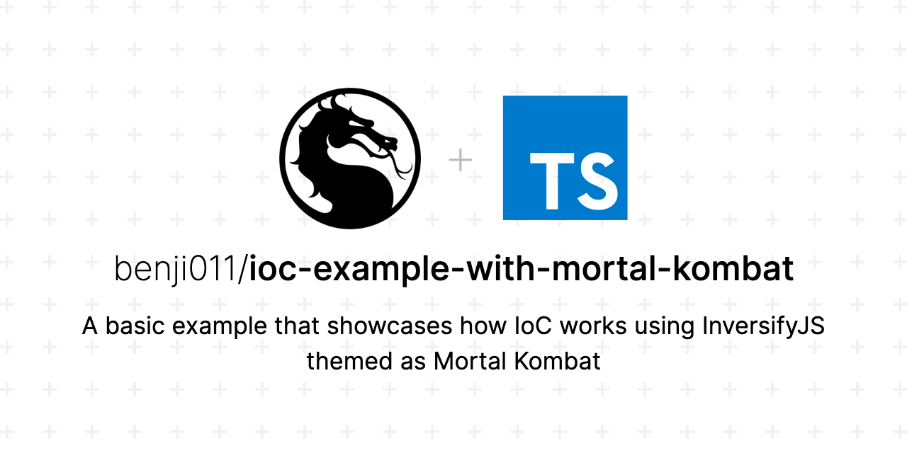

  <p align="center">
    
  </p>

# About

A simple IoC example based on the official InversifyJS library using the [official basic example](https://github.com/inversify/inversify-basic-example) but instead of just ordinary ninjas vs samurais it's themed as [Mortal Kombat](https://en.wikipedia.org/wiki/Mortal_Kombat).

# How to run

```bash
❯ yarn && yarn fight
yarn run v1.22.10
warning package.json: No license field
$ ts-node -r tsconfig-paths/register src/main.ts
FIGHT!
                Sub-Zero (Ice Scepter)
                vs
                Scorpion (Kunai)
✨  Done in 1.97s.
```

# To do

1. [ ] Add unit tests
2. [ ] Document project structure

## Notes

※ The `reflect-metadata` polyfill should be imported only once in your entire application because the Reflect object is mean to be a global singleton

※ It is recommended to use Symbols but InversifyJS also support the usage of Classes and string literals.
